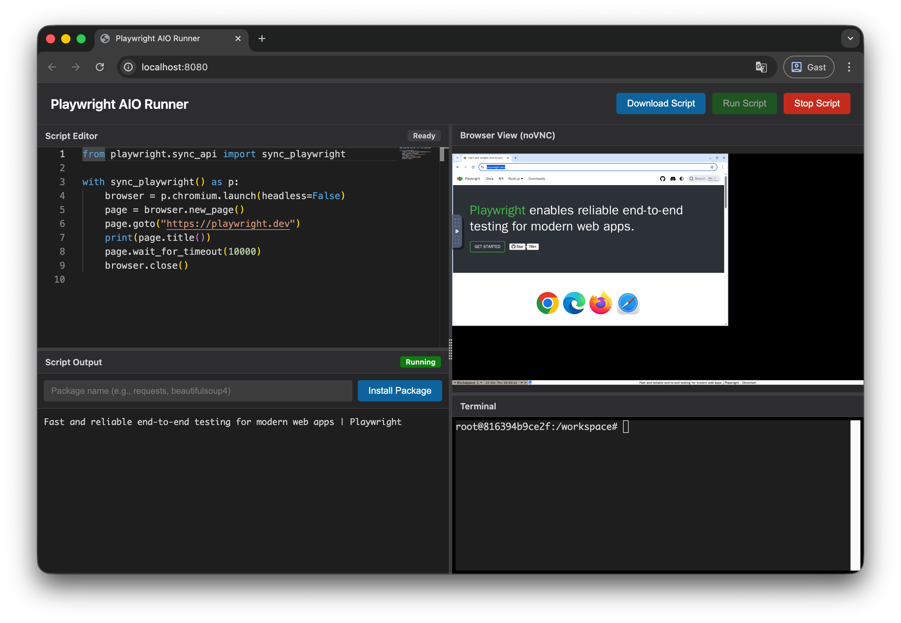

# Playwright AIO Runner

All-in-one Playwright Python runner with a web-based IDE, terminal, and browser viewer.



## Quick Start

Run from GitHub Container Registry:

```bash
docker run -d --name playwright-aio -p 8080:8080 -p 6080:6080 --shm-size=2gb ghcr.io/lonetis/playwright-aio:latest
```

**Access:** http://localhost:8080

**Stop:**
```bash
docker stop playwright-aio && docker rm playwright-aio
```

> **Note:** `--shm-size=2gb` increases shared memory to prevent browser crashes (default is only 64MB)

## Local Development

Start (builds and runs):
```bash
./start.sh
```

Stop:
```bash
./stop.sh
```

## Features

- **Monaco Editor** - Full VS Code editing experience with auto-save
- **Live Script Execution** - Run Playwright scripts with real-time output
- **Browser View** - See and control browsers via noVNC (Full HD 1920x1080)
- **All Browsers Included** - Chromium, Firefox, and WebKit pre-installed
- **Interactive Terminal** - Full bash terminal with stdin support
- **Package Management** - Install Python packages on-the-fly
- **Download Scripts** - Export your work locally
